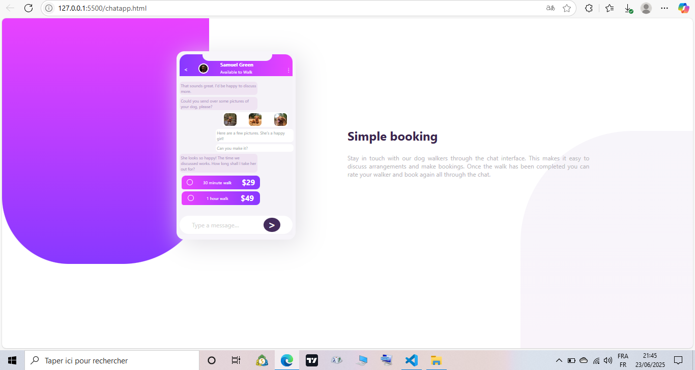
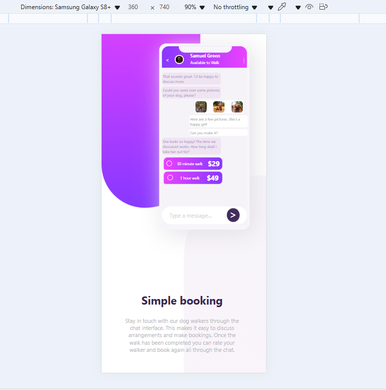

# Challenge Frontend Mentor - Solution du composant de carte à aperçu en 3 colonnes

Bonjour bonjour. Voici mon code pour le défi de l'application de chat sur Frontend Mentor (https://www.frontendmentor.io/challenges/chat-app-css-illustration-O5auMkFqY)..

## Table des matières

- [Aperçu](#aperçu)
  - [Le défi](#le-défi)
  - [Capture d'écran](#capture-décran)
  - [Liens](#liens)
- [Mon processus](#mon-processus)
  - [Construit avec](#construit-avec)
  - [Ce que j'ai appris](#ce-que-jai-appris)
  - [Développement continu](#développement-continu)
  - [Ressources utiles](#ressources-utiles)
- [Auteur](#auteur)
- [Remerciements](#remerciements)

## Aperçu

### Le défi
Les utilisateurs doivent pouvoir :

- Voir la disposition optimale du composant selon la taille de l’écran de leur appareil
- **Bonus** : Voir l’interface du chat s’animer au chargement initial

### Capture d'écran

### Liens

- URL de la solution :(https://github.com/matteohgweb/chatapp.git)
- URL du site en ligne :(https://your-live-site-url.com)

## Mon processus

### Construit avec

- Balises HTML5 sémantiques
- Propriétés personnalisées CSS
- Flexbox
- Approche mobile-first

### Ce que j'ai appris

Ce projet m’a permis de renforcer ma compréhension du design responsive et de l’utilisation de CSS flexbox pour la mise en page. J’ai aussi pratiqué la personnalisation des variables CSS pour le thème des couleurs et j’ai appris à faire attention aux différences subtiles de design selon les points de rupture.

### Développement continu

Je souhaite continuer à approfondir mes connaissances sur les bonnes pratiques d’accessibilité, en particulier pour les éléments interactifs et la navigation au clavier. J’aimerais aussi explorer davantage les propriétés personnalisées CSS pour un theming évolutif.

### Ressources utiles

- [CSS Tricks : Guide complet de CSS flexbox](https://css-tricks.com/snippets/css/complete-guide-flexbox/) - Une ressource précieuse pour maîtriser CSS flexbox.
- [MDN Web Docs : Design responsive](https://developer.mozilla.org/fr/docs/Learn/CSS/CSS_layout/Responsive_Design) - M’a aidé à consolider mon approche des mises en page responsives.

## Auteur

- Frontend Mentor - [@matteohgweb](https://www.frontendmentor.io/profile/matteohgweb)
- Github - [@matteohgweb](https://github.com/matteohgweb)

## Remerciements

Merci à tous et à la communauté Frontend Mentor pour ses retours et son inspiration !